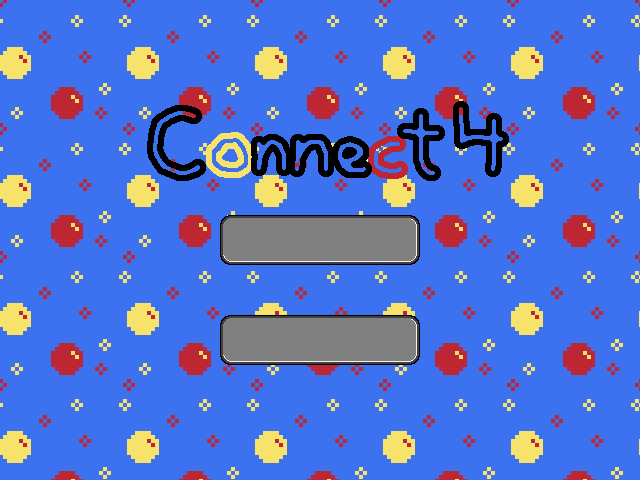

# Connect Four

## Description

A basic Connect Four implementation using a game engine built with SDL2.



## Setup

### On Linux

```bash
$ mkdir build && cd build
$ cmake -G "Unix Makefiles" -DCMAKE_BUILD_TYPE=Debug ../
$ make && make install
```

### On Windows (MinGW)

Place SDL2 and its extensions' development libraries on the system.

```batch
> mkdir build && cd build
> cmake -G "MinGW Makefiles" -DCMAKE_BUILD_TYPE=Debug ../
> mingw32-make && mingw32-make install
```
